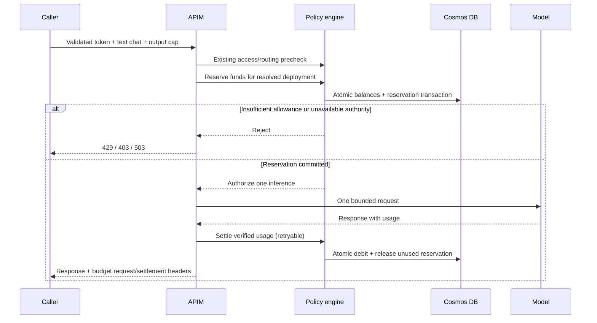

# USD budgets for AI requests

The **Budgets** dashboard and **Entra JWT — AI USD budget (text chat)** APIM template add weekly and monthly dollar allowances across approved model deployments. An administrator can assign a $50 monthly allowance to a user, application, or group. Group assignments explicitly choose **Per member** or **Shared by group**.

This is the first implementation: **non-streaming, text-only Chat Completions**, one completion per request. Streaming, Responses, image/audio, tools, Keycloak and subscription-key budget templates are not supported yet. Unsupported requests are rejected before inference. Existing templates keep their existing behavior until replaced with the budget template.

## Activate a $50/month allowance

1. Deploy the updated API and dashboard using the existing [deployment guide](DOTNET_DEPLOYMENT_GUIDE.md). No additional database container or Azure service is introduced.
2. Sign in with the existing `AIPolicy.Admin` role. Open **Budgets**, enter the Entra tenant UUID and select **Load budgets**.
3. Add an allowance policy with amount **50**, period **Monthly**. Monthly resets occur on the first at 00:00 UTC. Weekly resets occur on Monday at 00:00 UTC. These are fixed calendar windows, not rolling windows or 30-day months.
4. Assign the policy to a user's **object ID**, a group's **object ID**, or an application's **client ID**. Choose **Per member** to give each group member $50 independently. Choose **Shared by group** for one $50 pool. A user sharing the same policy through multiple per-member groups gets one allowance, not multiple allowances. If weekly and monthly policies both match, both must have funds.
5. Add approved deployment prices and a price version. Enter input, cached input and output rates in **USD per million tokens**. Use your provider/contract rates. These are separate from the legacy Pricing page; there are no guessed defaults. Missing deployment prices block access.
6. Set each deployment's **backend input/context limit** to at least its actual hard input limit. Set the permitted output limit no higher than the backend's supported limit. Use the highest applicable text input/output rates for the allowed request mode, including long-context price tiers when applicable. A deployment alias must map to the same model/version and price across all backend routes using it.
7. Save the configuration. In **APIs**, apply **Entra JWT — AI USD budget (text chat)** to the protected AI API, providing `TenantId`, `ExpectedAudience`, `ContainerAppAudience` and `ContainerAppUrl`. The template uses the existing `openAiBackend` or the deployment returned by the existing router. Replace the prior AI template; do not stack two accounting or forwarding templates.
8. Keep the existing client application + tenant plan assignment for access and routing. In **Plans**, disable **Enforce token allowance** if dollars should replace token allowances. Set multiplier request quota to zero or disable multiplier billing if request allowances should not apply. RPM/TPM safeguards and deployment allowlists remain available. `MonthlyRate` is still a subscription price, not a budget.
9. Ensure every accessible inference route is protected, direct model access is restricted, and no operation override or inherited policy can bypass authorization or initiate additional inference. The template permits only `POST .../deployments/{deployment}/chat/completions`, makes one backend attempt and does not retry inference.
10. Verify against a staging APIM/Cosmos deployment before production: check a successful request, a 429 budget rejection, concurrent requests, an interrupted callback and administrator reconciliation. Local tests do not execute Azure's policy-expression compiler or a live Cosmos transaction.

## Identity requirements

The template validates an Entra JWT for the configured tenant and audience. It forwards identity from the validated JWT, never from caller-provided identity headers. Delegated tokens use `tid` + `oid` for the user and `azp`/`appid` for the application. Application-only tokens cannot claim a human user's allowance.

Configure the calling application's access tokens to include group object IDs when using group policies. Missing or overage group claims cause a delegated request to be rejected when the tenant has group assignments. There is no Microsoft Graph membership lookup in this version. Request a fresh token after membership changes; membership freshness follows the token lifetime.

Only APIM's managed identity should have `AIPolicy.Apim`. The backend trusts that privileged service to attest the original identity and usage. Ordinary clients must not receive this role. Budget administration follows the project's existing global `AdminPolicy`, not per-tenant administrator isolation.

## How spending is enforced



The admission condition for **every matching bucket** is:

`spent USD + reserved USD + maximum request USD <= allowance USD`

The maximum reserves the deployment's **full configured input limit**, plus the explicitly requested `max_completion_tokens` or `max_tokens`, priced at uncached input and output rates. This is intentionally conservative: a request may be rejected while some dollars remain. The caller must supply exactly one output cap. No inferred prompt count is used to claim a hard guarantee. Accurate backend bounds and prices are prerequisites for the dollar ceiling.

Settlement uses actual prompt/completion counts and reported cached input, priced with the reservation's immutable price snapshot. Money uses decimal arithmetic rounded up to nine decimal places, so tiny requests do not become free. The configured price book determines the allowance debit; this is not an exact Azure invoice or a cap on APIM, networking, storage or other infrastructure costs.

An observed usage/billing-bound overrun is recorded at actual cost and flags the reservation. The matching unsafe model price is removed from active configuration, stopping new reservations using that configuration until an administrator corrects it. Actual provider charges already incurred cannot be undone.

## Reliability and reconciliation

- Balances, configuration and reservation records share the existing Cosmos `configuration` container, partitioned as `budget:{tenantId}`. ETag-guarded transactional batches atomically update all applicable balances and the reservation. Redis is not the spending authority.
- Use a Cosmos account with **one write region**. Multi-write conflict resolution is not sufficient for this ledger's hard-limit semantics. Keep financial documents free of automatic TTL deletion. Account failover/restore procedures must preserve committed ledger data.
- A repeated reservation ID returns **409** and never authorizes another inference. A repeated settlement with identical usage returns the original result without another debit. Conflicting usage returns **409**.
- Late settlement charges the original period, even after a reset. Configuration edits cannot change an existing policy's period; create a new policy when intentionally changing that behavior. Lowering a limit does not cancel previously authorized calls.
- Missing usage, errors, timeouts and lost callbacks leave the reservation outstanding. Reservations **do not expire automatically**, since a failed connection may still incur a provider charge.
- APIM attempts settlement synchronously, with two retries for server failures. `X-Budget-Request-Id` identifies the ledger record; `X-Budget-Settlement` is `settled` or `pending-reconciliation`. A settlement outage does not erase the reservation or trigger another inference.
- In **Budgets → Pending reservations**, verify actual backend usage, enter counts and an evidence note, then reconcile. Enter zero counts only after verifying that no billable inference occurred. The stored note includes the administrator identity. Automated recovery from provider usage logs is future work.
- Budget rejections are emitted as structured `BudgetEnforcement` warning logs with tenant, trace and reason code. Existing analytics ingestion remains separate from the budget ledger.

The first implementation limits configuration to 100 policies, 500 assignments and 100 model prices per tenant, with 20 matching buckets per request. Dashboard queries return at most 500 records. Inspect older records in Cosmos and reconcile by request ID via the API when necessary. All writes within a tenant touch the configuration document to serialize authorization against edits; test throughput and contention for your workload. Tenant partitions are subject to Cosmos logical-partition limits. Archival and partition scaling require a follow-up design that preserves active balances and duplicate protection.

## API contract

All routes below start with `/api/budgets/{tenantId}`; tenant IDs are UUIDs.

| Method and route | Role | Purpose |
|---|---|---|
| `GET /configuration` | Admin | Load policies, assignments and approved prices |
| `PUT /configuration` | Admin | Save the entire configuration with its current `revision`; stale writes return 409 |
| `GET /balances` | Admin | Inspect durable balances |
| `GET /reservations` | Admin | Inspect reservations and settlement status |
| `POST /reserve` | APIM | Atomically reserve across all matching allowances |
| `POST /reservations/{requestId}/settle` | APIM | Idempotently settle verified backend usage |
| `POST /reservations/{requestId}/reconcile` | Admin | Settle an unresolved reservation with an evidence note |

Example reservation body, sent only by the trusted gateway:

```json
{
  "requestId": "aaaaaaaa-aaaa-aaaa-aaaa-aaaaaaaaaaaa",
  "clientAppId": "22222222-2222-2222-2222-222222222222",
  "userId": "33333333-3333-3333-3333-333333333333",
  "groupIds": ["44444444-4444-4444-4444-444444444444"],
  "groupsComplete": true,
  "deploymentId": "your-approved-deployment",
  "requestBody": {
    "messages": [{ "role": "user", "content": "Hello" }],
    "max_completion_tokens": 1000
  }
}
```

Settlement body (both prompt and completion fields are required):

```json
{"usage":{"promptTokens":120,"completionTokens":80,"cachedInputTokens":0}}
```

Administrator reconciliation additionally requires `"note": "Evidence identifying verified backend usage"`.

## Verification

```sh
dotnet test src/AIPolicyEngine.Tests/AIPolicyEngine.Tests.csproj -p:SkipSpaBuild=true --filter 'FullyQualifiedName~Budgets|FullyQualifiedName~Template'
cd src/aipolicyengine-ui
npm ci
npm run build
npm test
```

Tests cover concurrent admission, shared/per-member assignments, multi-policy rollback, period boundaries, late settlement, price snapshots, missing usage, duplicate reservation/settlement, endpoint authorization, Cosmos batch ETags/serialization/failures and template rendering. Cosmos is mocked/in-memory in these tests; staging verification remains necessary.
